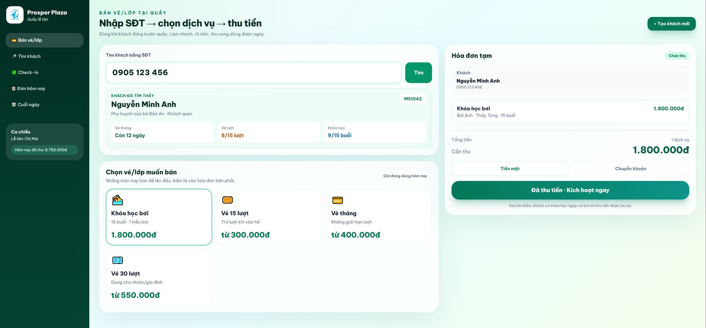

# 🎨 Bản nháp giao diện màn quầy — anh xem trước nha

Trước khi sửa sâu phần chạy thật, em vẽ trước màn quầy theo hướng anh chốt: **không làm lại từ trắng**, dùng giao diện sẵn có làm nền, nâng cấp cho **sang xịn** và dễ dùng lúc đông khách.

## 1. Màn bán vé/lớp tại quầy

Màn này gom những việc lễ tân làm nhiều nhất:

- Nhập SĐT để tìm khách.
- Thấy ngay vé tháng, vé lượt, khóa học đang còn.
- Chọn vé/lớp muốn bán.
- Nhìn tổng tiền rõ bên phải.
- Bấm đã thu tiền là kích hoạt ngay.

## Em đang ưu tiên gì?

- Ô SĐT thật lớn vì anh nói nghẽn nhất là tìm khách.
- Dịch vụ hay bán nằm ngay giữa màn.
- Tổng tiền và nút thu tiền nằm cố định bên phải.
- Giao diện xanh sạch, sang hơn, nhưng không rối.

## Anh thấy sao?

1️⃣ **Đẹp rồi, đi tiếp** ⭐ — em dùng hướng này để sửa màn quầy thật.

2️⃣ **Đổi vài chỗ** — anh nói em đổi màu, chữ, nút, bố cục, hoặc phần nào cần to/rõ hơn.

3️⃣ **Đổi hướng khác** — anh muốn vibe khác hẳn.
